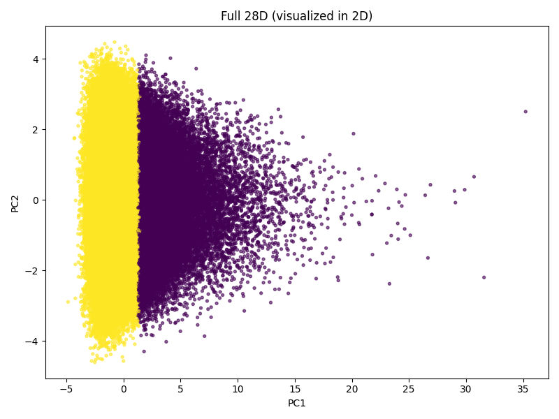
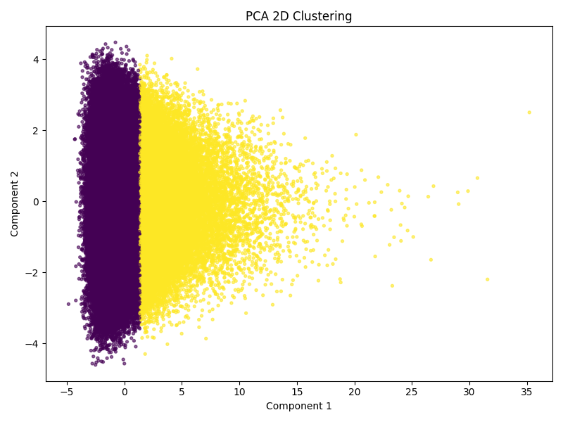

# K-Means Clustering & PCA Evaluation

This report evaluates the clustering quality of k-Means on the raw 28-dimensional HIGGS dataset versus PCA-reduced versions (2, 5, and 10 components) using a 200,000-row subsample.

## 1. Variance Preservation
**How many components preserve most variance?**

Based on the PCA analysis of the 28 continuous physics-derived attributes, the dataset's variance is highly distributed. 
* **95% Variance Threshold:** To preserve 95% of the cumulative variance, **23 principal components** are required.
* **Information Loss:** Reducing the dataset to 10, 5, or 2 dimensions results in a significant loss of information. The first two components explain only ~22% of total variance combined (PC1 ≈ 15%, PC2 ≈ 7%).

## 2. Quantitative Clustering Quality

We evaluated cluster compactness and separation for $k=2$ across the different feature spaces. 

| Dataset | Silhouette Score | Davies-Bouldin Index | Compactness | Separation |
| :--- | :--- | :--- | :--- | :--- |
| **Raw 28D** | 0.1986 | 2.6714 | 4.9044 | 4.0749 |
| **PCA 10D** | 0.2652 | 1.9820 | 3.5956 | 4.0513 |
| **PCA 5D** | 0.3541 | 1.4610 | 2.6289 | 4.1181 |
| **PCA 2D** | 0.4898 | 0.8753 | 1.6236 | 4.1408 |

**Analysis of Metrics:**
The metrics superficially improve as dimensions decrease (e.g., Silhouette increases from 0.19 to 0.48, and Compactness drops from 4.90 to 1.62). However, this is largely due to the "Curse of Dimensionality" in reverse. In 2D, points are mathematically closer to their centroids than in 28D, which inflates these specific metrics. Notice that physical **Separation** between the cluster centers remains nearly identical (~4.05 to 4.14) across all dimensions, indicating the clusters aren't actually becoming more distinct.

## 3. Computational Scalability
**Does k-Means converge faster after PCA?**

Yes. By reducing the feature space, the algorithm performs distance calculations and centroid updates much more efficiently. 
* **Raw 28D Runtime:** 2.68 seconds
* **PCA 10D Runtime:** 0.26 seconds
* **PCA 5D Runtime:** 0.19 seconds
* **PCA 2D Runtime:** 0.16 seconds

In our pipeline, clustering the PCA 2D dataset was over **16 times faster** than clustering the full 28-dimensional space. This demonstrates that PCA is a vital preprocessing tool for scaling k-Means to large datasets like HIGGS.

## 4. Visual Analysis & Cluster Meaning
**Does PCA improve cluster separation? Are clusters more meaningful in lower-dimensional space?**

* **Cluster Separation:** PCA does **not** improve visual cluster separation. Across all plots, the data remains a single, contiguous dense cloud. The k-Means algorithm consistently bisects this cloud along a vertical axis near PC1 ≈ 1.5. 
* **Meaningfulness:** The clusters are **not** more meaningful in lower-dimensional space. Because the HIGGS dataset consists of overlapping signal and background event attributes, k-Means is essentially forcing a split in a continuous distribution. Dropping to 2 or 5 dimensions only captures the most dominant linear correlations but does not reveal distinct physical groupings that weren't already present in the high-dimensional data.

 

 